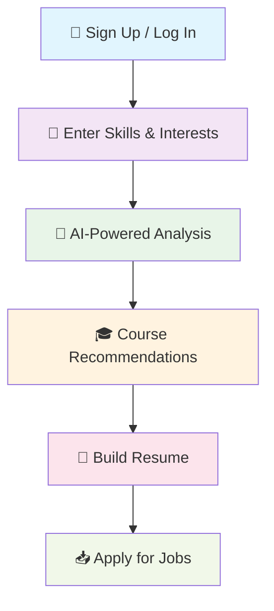

# 🎯 JobSensei

> **Empowering Career Growth Beyond City Limits**

[](https://firebase.google.com/)
[](https://developer.mozilla.org/en-US/docs/Web/JavaScript)
[](https://developers.google.com/youtube/v3)
[](https://ai.google/)

---

## 🌟 **What is JobSensei?**

JobSensei is an **AI-powered career guidance platform** specifically designed for students and job seekers in **non-metro and underserved regions**. We bridge the gap between talent and opportunity by providing personalized career advice, skill analysis, and curated learning resources - all accessible through a lightweight, mobile-friendly interface.

### 🚀 **Our Mission**
To democratize career guidance and make quality upskilling resources accessible to everyone, regardless of their geographical location or economic background.

---

## ✨ **Core Features**

### 🧠 **AI-Powered Skill Analysis**
- Intelligent interpretation of user skills and competencies
- Smart mapping to relevant job roles across industries
- Identification of skill gaps with actionable improvement suggestions

### 🎯 **Personalized Job Recommendations**
- Tailored career paths based on skills and interests
- Industry-specific role suggestions
- Strategic guidance for focused job searching

### 📚 **Free Course Integration**
- **YouTube Data API** integration for high-quality, free courses
- Curated content aligned with identified skill gaps
- Beginner-friendly resources optimized for non-metro users

### 📱 **Mobile-First Design**
- Optimized for low-bandwidth environments
- Intuitive UI for users with varying digital literacy levels
- Fast-loading, responsive interface

### 📄 **Smart Resume Builder**
- Auto-populated resume fields from user profiles
- Customizable templates and formats
- One-click PDF download for instant job applications

### 🔐 **Secure User Profiles**
- **Firebase Authentication** for secure access
- Personalized dashboard for progress tracking
- Data privacy and security compliance

### 🌍 **Smart Language Support**
- Context-aware translations in Indian regional languages
- Culturally relevant content adaptation
- Enhanced accessibility for diverse user base

---

## 💻 **Technology Stack**

### **Frontend**
```
🏗️ HTML5        - Semantic, structured markup
🎨 CSS3         - Responsive, mobile-first styling  
⚡ JavaScript   - Dynamic interactivity & API integration
```

### **Backend & Cloud**
```
☁️ Firebase Firestore    - Scalable NoSQL database
🔥 Firebase Hosting      - Fast, reliable deployment
🔐 Firebase Auth         - Secure user management
📊 Firebase Realtime DB  - Real-time data synchronization
```

### **APIs & AI**
```
🤖 Google Gemini API     - YUKI chatbot intelligence
📺 YouTube Data API      - Course content curation
```

### **Development Tools**
```
🔧 Git & GitHub         - Version control & collaboration
🚀 Firebase CLI         - Deployment automation
🎨 Figma & Canva        - UI/UX design
🔍 Chrome DevTools      - Testing & debugging
```

---

## 🛣️ **User Journey**



1. **🔐 Secure Registration** - Create your personalized account
2. **🧾 Profile Building** - Input skills, tools, and interests
3. **🧠 AI Analysis** - Get matched with relevant job roles and skill gap insights
4. **🎓 Skill Development** - Explore curated free courses from YouTube
5. **📄 Resume Creation** - Build and download professional resumes
6. **📥 Job Applications** - Apply directly to curated opportunities *(Coming Soon)*

---

## 🏆 **Key Challenges Solved**

| Challenge | Our Solution |
|-----------|--------------|
| **🌐 Limited Connectivity** | Lightweight, fast-loading platform optimized for low bandwidth |
| **📊 API Quota Management** | Efficient YouTube Data API usage with smart caching |
| **🎯 Content Quality** | AI-powered filtering for high-quality, relevant educational content |
| **🌍 Language Barriers** | Context-aware regional language support |
| **💰 Cost Accessibility** | 100% free platform with free learning resources |

---

## 🚀 **Getting Started**

### Prerequisites
```bash
Node.js >= 14.0.0
Firebase CLI
Git
```

### Quick Setup
```bash
# Clone the repository
git clone https://github.com/yourusername/jobsensei.git

# Navigate to project directory
cd jobsensei

# Install Firebase CLI (if not already installed)
npm install -g firebase-tools

# Login to Firebase
firebase login

# Initialize Firebase in your project
firebase init

# Deploy to Firebase Hosting
firebase deploy
```

---

## 🌟 **What Makes JobSensei Unique?**

| **Traditional Platforms** | **JobSensei** |
|---------------------------|---------------|
| ❌ Urban-focused | ✅ Non-metro specific |
| ❌ Paid resources | ✅ 100% free courses |
| ❌ Generic recommendations | ✅ AI-powered personalization |
| ❌ High bandwidth required | ✅ Low-bandwidth optimized |
| ❌ Complex interfaces | ✅ Simple, intuitive design |

---

## 🔮 **Upcoming Features**

- 🤖 **Enhanced YUKI Chatbot** - More intelligent career conversations
- 📋 **Resume Parsing** - Extract skills from existing resumes
- 🔔 **Smart Notifications** - Job alerts and learning reminders
- 👥 **Mentorship Program** - Connect with industry professionals
- 🎯 **Direct Job Applications** - One-click apply to curated positions

---

## 📈 **Impact & Vision**

**Our Goal**: To empower **10,000+ users** in non-metro regions to confidently navigate their career journeys and improve their employability.

### Target Metrics
- 🎯 **User Engagement**: 75% monthly active users
- 📚 **Learning Completion**: 60% course completion rate  
- 💼 **Job Success**: 40% job placement rate within 6 months
- 🌍 **Reach**: 500+ cities across India

---

## 📄 **License**

This project is licensed under the **MIT License** - see the [LICENSE](LICENSE) file for details.

---

## 👨‍💻 **Team**

Built with ❤️ by developers who believe in equal opportunity for all.

---

<div align="center">

### ⭐ **If JobSensei helped you, please consider giving us a star!** ⭐

**Made with 💙 for everyone who dreams big, regardless of where they come from.**

</div>
