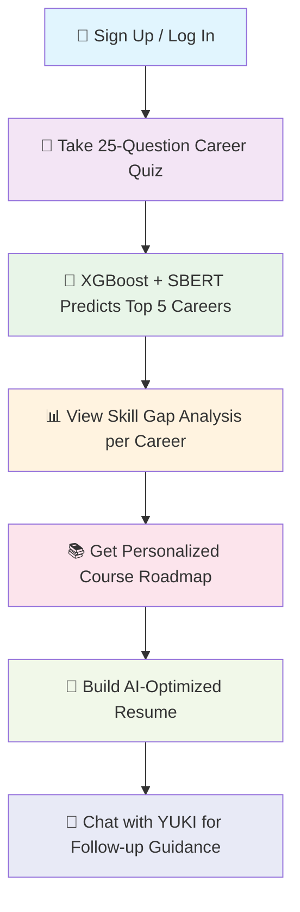

# 🎯 JobSensei

> **Empowering Career Growth Beyond City Limits**

[](https://firebase.google.com/)
[](https://developer.mozilla.org/en-US/docs/Web/JavaScript)
[](https://developers.google.com/youtube/v3)
[](https://ai.google/)
[](https://xgboost.readthedocs.io/)
[](https://fastapi.tiangolo.com/)
[](https://www.python.org/)

---

## 🌟 **What is JobSensei?**

JobSensei is an **AI-powered career guidance platform** specifically designed for students and job seekers in **non-metro and underserved regions**. We bridge the gap between talent and opportunity through a real machine learning career prediction engine, skill gap analysis, curated learning resources, and an AI-powered resume builder — all through a lightweight, mobile-friendly interface.

### 🚀 **Our Mission**
To democratize career guidance and make quality upskilling resources accessible to everyone, regardless of their geographical location or economic background.

---

## ✨ **Core Features**

### 🧠 **ML-Powered Career Discovery Quiz**
- **Real XGBoost Classifier** trained on O\*NET v28.2 (US Dept of Labor) + BLS OEWS 2024 salary data
- 25-question quiz: RIASEC interest scores, skill ratings, work preferences, and 3 open-ended descriptive text answers
- **SBERT (all-MiniLM-L6-v2)** semantic embeddings process descriptive answers at prediction time — understanding meaning, not keywords
- Returns **Top 5 career matches** with ML confidence scores, per-career precision/recall/F1, and readiness scores
- **406 total input features** — 22 MCQ features + 384-dim SBERT embeddings
- Full model metrics exposed via REST API for complete transparency

### 📊 **Real Government Datasets**
- **O\*NET Database v28.2** — 900+ occupations with RIASEC interest profiles and skill requirements (US Dept of Labor, public domain)
- **BLS OEWS 2024** — Real annual salary and employment figures for all 24 career categories (Bureau of Labor Statistics, public domain)
- Zero hallucination — every career insight is grounded in verified official data

### 🎯 **Skill Gap Analysis**
- Required skills per career sourced directly from O\*NET occupational data
- Identifies which skills the user already has based on quiz responses
- Shows exact skill gaps with actionable learning suggestions
- Readiness score (0–100%) per career match

### 📚 **Learning Roadmap with Course Recommendations**
- **YouTube Data API** integration for high-quality free courses
- Curated content aligned with identified skill gaps and target career
- Phased roadmap — beginner through advanced
- Optimized for non-metro users on low-bandwidth connections

### 📄 **AI-Powered Resume Builder**
- Jake's Resume format — clean, ATS-friendly professional template
- Claude AI generates and improves resume bullet points
- ATS score analysis and optimization suggestions
- One-click PDF download for instant job applications
- Auto-populated from user profile and career assessment results

### 🤖 **YUKI — AI Career Chatbot**
- Powered by Google Gemini API
- Grounded in O\*NET occupation descriptions for accurate, verified answers
- Context-aware career conversations — not generic chatbot responses
- Answers follow-up questions about career paths, salaries, skills, and job market trends

### 🔐 **Secure User Profiles**
- Firebase Authentication for secure access
- Personalized dashboard for progress tracking
- Data privacy and security compliance

### 🌍 **Smart Language Support**
- Context-aware translations in Indian regional languages
- Culturally relevant content adaptation
- Enhanced accessibility for diverse user base

### 📱 **Mobile-First Design**
- Optimized for low-bandwidth environments
- Intuitive UI for users with varying digital literacy levels
- Fast-loading, responsive interface

---

## 💻 **Technology Stack**

### **Frontend**
```
🏗️ HTML5        - Semantic, structured markup
🎨 CSS3         - Responsive, mobile-first styling
⚡ JavaScript   - Dynamic interactivity & API integration
```

### **Backend & Cloud**
```
☁️ Firebase Firestore    - Scalable NoSQL database
🔥 Firebase Hosting      - Fast, reliable deployment
🔐 Firebase Auth         - Secure user management
📊 Firebase Realtime DB  - Real-time data synchronization
⚡ FastAPI               - Python REST API serving ML predictions
```

### **ML Model**
```
🤖 XGBoost Classifier    - Multi-class career prediction (24 careers)
🧠 SBERT MiniLM-L6-v2   - Semantic text embeddings (384 dimensions)
📊 scikit-learn          - Preprocessing, metrics, cross-validation
🏷️ LabelEncoder          - MCQ categorical feature encoding
📐 StandardScaler        - Feature normalization
```

### **Datasets**
```
📋 O*NET v28.2           - RIASEC profiles + skill data (900+ occupations)
💰 BLS OEWS 2024         - Real salary & employment data (24 career categories)
```

### **APIs & AI**
```
🤖 Google Gemini API     - YUKI chatbot intelligence
📺 YouTube Data API      - Course content curation
🧠 SBERT                 - Semantic text embeddings at prediction time
```

### **Development Tools**
```
🔧 Git & GitHub         - Version control & collaboration
🚀 Firebase CLI         - Deployment automation
🎨 Figma & Canva        - UI/UX design
🔍 Chrome DevTools      - Testing & debugging
🐍 Python 3.x           - ML model training & API
```

---

## 🏗️ **Architecture**

```
┌─────────────────────────────────────────────────┐
│              Frontend (HTML/CSS/JS)             │
│            Firebase Hosted Web App              │
└──────────────┬──────────────────┬───────────────┘
               │                  │
    ┌──────────▼──────┐  ┌───────▼────────────────┐
    │  Firebase Suite  │  │   FastAPI ML Server     │
    │  - Firestore DB  │  │   localhost:8000        │
    │  - Firebase Auth │  │                         │
    │  - Realtime DB   │  │  POST /predict          │
    └──────────────────┘  │  GET  /metrics          │
                          │  GET  /metrics/per-career│
    ┌─────────────────┐   │  GET  /model-info       │
    │  External APIs  │   └──────────┬──────────────┘
    │  - Gemini API   │              │
    │  - YouTube API  │   ┌──────────▼──────────────┐
    └─────────────────┘   │       ML Pipeline        │
                          │  O*NET v28.2 + BLS 2024  │
                          │  XGBoost + SBERT 406-dim │
                          │  24 Career Categories    │
                          └──────────────────────────┘
```

---

## 🛣️ **User Journey**


```mermaid
graph TD
    A[🔐 Sign Up / Log In] --> B[🎯 Take 25-Question Career Quiz]
    B --> C[🧠 XGBoost + SBERT Predicts Top 5 Careers]
    C --> D[📊 View Skill Gap Analysis per Career]
    D --> E[📚 Get Personalized Course Roadmap]
    E --> F[📄 Build AI-Optimized Resume]
    F --> G[🤖 Chat with YUKI for Follow-up Guidance]

    style A fill:#e1f5fe
    style B fill:#f3e5f5
    style C fill:#e8f5e8
    style D fill:#fff3e0
    style E fill:#fce4ec
    style F fill:#f1f8e9
    style G fill:#e8eaf6
```

1. **🔐 Secure Registration** — Create your account via Firebase Auth
2. **🎯 Career Quiz** — Answer 25 questions covering interests, skills, and work preferences
3. **🧠 ML Prediction** — XGBoost + SBERT returns Top 5 career matches with confidence scores
4. **📊 Skill Gap** — See exactly which O\*NET skills you have vs. what each career requires
5. **📚 Learning Roadmap** — Explore curated free YouTube courses aligned to your skill gaps
6. **📄 Resume Builder** — Generate an ATS-optimized resume with AI-improved bullet points
7. **🤖 YUKI Chatbot** — Ask follow-up career questions grounded in verified O\*NET data

---

## 📡 **ML API Endpoints**

| Endpoint | Method | Description |
|----------|--------|-------------|
| `/predict` | POST | Top 5 career predictions with confidence, F1, skill gap, readiness score |
| `/metrics` | GET | Overall model accuracy, precision, recall, F1 |
| `/metrics/per-career` | GET | Per-career precision/recall/F1 breakdown |
| `/model-info` | GET | Full model transparency — algorithm, data sources, features |
| `/careers` | GET | List all 24 supported career categories |
| `/docs` | GET | Interactive Swagger API documentation |

---

## 🏆 **Key Challenges Solved**

| Challenge | Our Solution |
|-----------|--------------|
| **🌐 Limited Connectivity** | Lightweight platform optimized for low bandwidth |
| **🤖 Generic AI Advice** | Real XGBoost ML model trained on official government data |
| **📊 No Data Transparency** | Full precision/recall/F1 exposed at `/metrics` and `/metrics/per-career` |
| **🎯 Skill Gap Unknown** | O\*NET-backed skill gap analysis per career match |
| **🌍 Language Barriers** | Context-aware Indian regional language support |
| **💰 Cost Accessibility** | 100% free platform with free learning resources |
| **📄 Resume Friction** | One-click AI resume generation with ATS scoring |

---

## 🚀 **Getting Started**

### Prerequisites
```bash
Node.js >= 14.0.0
Python >= 3.9
Firebase CLI
Git
```

### Frontend Setup
```bash
# Clone the repository
git clone https://github.com/yourusername/jobsensei.git
cd jobsensei

# Install Firebase CLI (if not already installed)
npm install -g firebase-tools
firebase login
firebase init
firebase deploy
```

### ML Model Setup
```bash
# Navigate to ML Model folder
cd "ML Model"

# Install Python dependencies
pip install pandas numpy scikit-learn xgboost sentence-transformers fastapi uvicorn openpyxl

# Step 1 — Build dataset from O*NET + BLS data
python combine_datasets.py

# Step 2 — Train XGBoost model + generate metrics
python train_model.py

# Step 3 — Start ML API server
python -m uvicorn fastapi_server:app --reload --port 8000

# Verify at: http://127.0.0.1:8000/metrics
```

### Required Data Files
```
ML Model/
├── onet_data/
│   ├── Interests.txt           ← O*NET v28.2  →  onetcenter.org
│   ├── Skills.txt
│   └── Occupation Data.txt
├── all_data_M_2024.xlsx        ← BLS OEWS 2024 →  bls.gov/oes
├── combine_datasets.py
├── train_model.py
└── fastapi_server.py
```

---

## 📈 **Model Performance**

| Metric | Details |
|--------|---------|
| **Algorithm** | XGBoost Classifier |
| **Training Data** | O\*NET v28.2 + BLS OEWS 2024 |
| **Text Embeddings** | SBERT all-MiniLM-L6-v2 (384-dim) |
| **Total Features** | 406 (22 MCQ + 384 SBERT) |
| **Careers Supported** | 24 |
| **Validation** | 5-fold Stratified Cross-Validation |

Live metrics: `http://localhost:8000/metrics` | Per-career: `http://localhost:8000/metrics/per-career`

---

## 🌟 **What Makes JobSensei Unique?**

| **Traditional Platforms** | **JobSensei** |
|---------------------------|---------------|
| ❌ Urban-focused | ✅ Built for non-metro regions |
| ❌ Paid resources | ✅ 100% free courses via YouTube |
| ❌ Generic recommendations | ✅ Real XGBoost ML + SBERT embeddings |
| ❌ No data transparency | ✅ Full precision/recall/F1 via API |
| ❌ High bandwidth required | ✅ Low-bandwidth optimized |
| ❌ No skill gap analysis | ✅ O\*NET-backed skill gap per career |
| ❌ Generic resume builder | ✅ AI bullet improvement + ATS scoring |
| ❌ Hallucinated career advice | ✅ Grounded in official US Dept of Labor data |

---

## 🔮 **Upcoming Features**

- 🎯 **Mock Interview Simulator** — AI-powered interview practice per predicted career
- 👥 **Mentor Match** — Connect with professionals who share your career path
- 📱 **WhatsApp Bot** — Career guidance accessible via WhatsApp for feature phones
- 🌐 **Expanded Language Support** — More Indian regional languages
- 🔔 **Smart Notifications** — Job alerts and learning reminders
- 📋 **Resume Parsing** — Extract and map skills from existing resumes
- 🤖 **Career Twin** — Real people with similar profiles who succeeded in matched careers

---

## 📈 **Impact & Vision**

**Our Goal**: To empower **10,000+ users** in non-metro regions to confidently navigate their career journeys and improve their employability.

### Target Metrics
- 🎯 **User Engagement**: 75% monthly active users
- 📚 **Learning Completion**: 60% course completion rate
- 💼 **Job Success**: 40% job placement rate within 6 months
- 🌍 **Reach**: 500+ cities across India

---

## 📄 **License**

This project is licensed under the **MIT License** — see the [LICENSE](LICENSE) file for details.

---

## 👩‍💻 **Team**

Built with ❤️ by developers who believe in equal opportunity for all.

---

<div align="center">

### ⭐ **If JobSensei helped you, please consider giving us a star!** ⭐

**Made with 💙 for everyone who dreams big, regardless of where they come from.**

</div>
